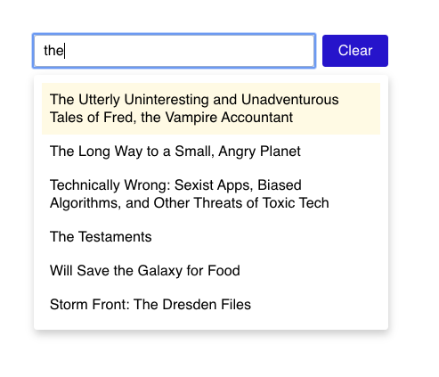

# Exercise 2: Showing and picking suggestions

When the user types in the input, we want to check and see if any of the suggestions match.

Here are some rules:

## It should be case insensitive

Given a title "The Girls":

✅ "The"
✅ "the"

## It should look for matches anywhere in the word

Given a title "The Girls":

✅ "The"
✅ "the G"
✅ "irls"
⛔️ "The Guys"

## The user should have entered at least 2 letters

Given a title "The Girls":

✅ "The"
✅ "Th"
⛔️ "T"

Start by trying to render a list of the matches below the input:


Most of these results have the word "the" in them explicitly. The third item, "Technically Wrong", has it hidden in the word "oTHEr".

You should use a `<ul>` and `<li>`.

> HINT: You'll want to use `filter` to winnow down the list of suggestions, and then use `map` to render an `<li>` for each matched result.

Next, we'll need to be able to tell when the user selects one of the suggestions. There are two ways this can happen:

- The user can click on one of the suggestions
- The user can press "Enter" on their keyboard to select the currently selected suggestion.

We'll solve that second case a little further on. For now, let's add a hover state and an `onClick` event. This event should call the `handleSelect` prop with the current suggestion's title.

Give this a shot, and then take a look at the hint for how we decided to do it.

> 🆘 **If you are stuck, or want to compare, you can look at this [hint](./_hints/hint-2.md).**

After you have the logic working, add some styles to match the mockup. You can add a subtle yellow background on hover to indicate which option is selected:



To do this, you'll want to use styled-components. You can create a new `Suggestion` component:

```jsx
// Inside your component, replacing the `<li>`:
<Suggestion key={suggestion.id} onClick={() => handleSelect(suggestion.title)}>
  {suggestion.title}
</Suggestion>;

// further down:
const Suggestion = styled.li`
  // styles here, including hover styles.
`;
```
